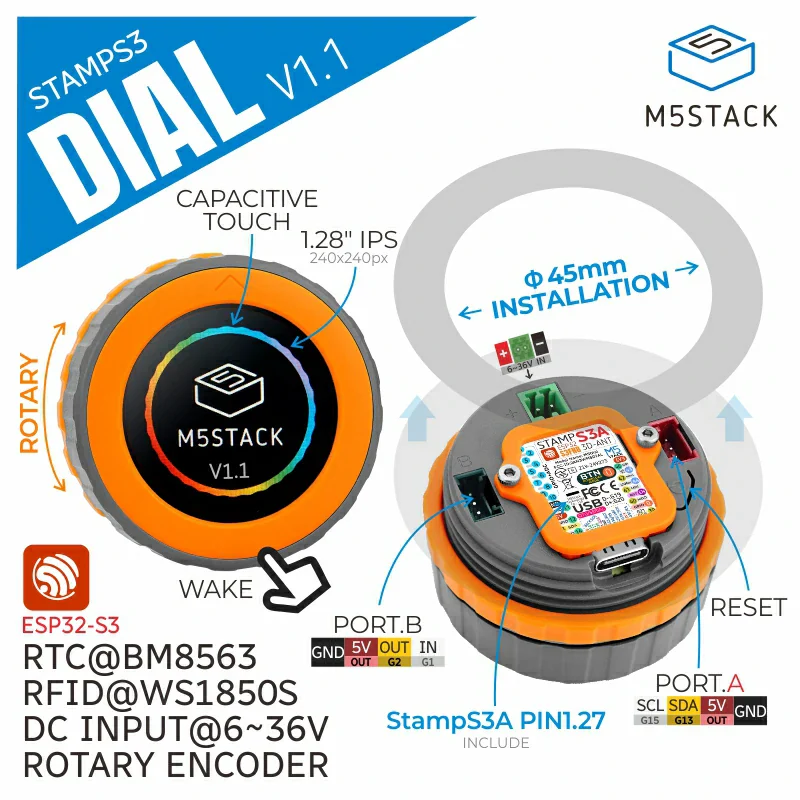
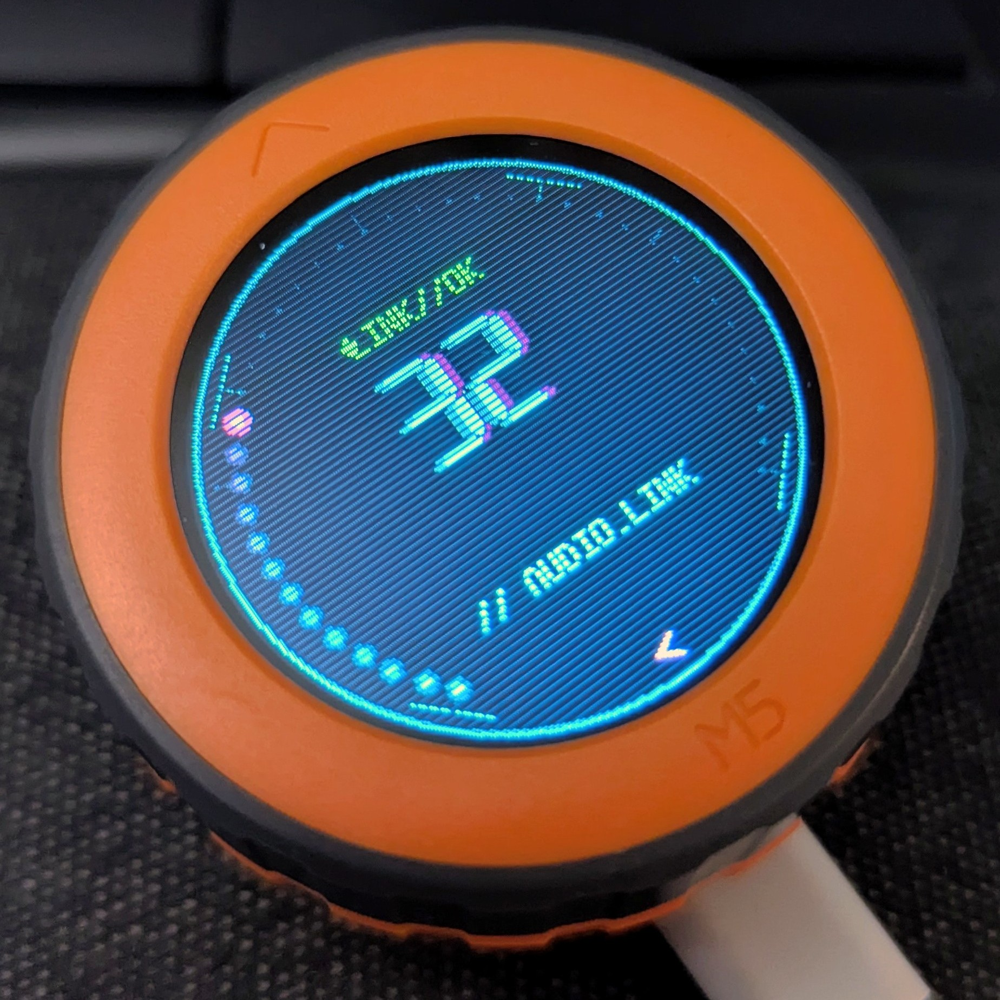
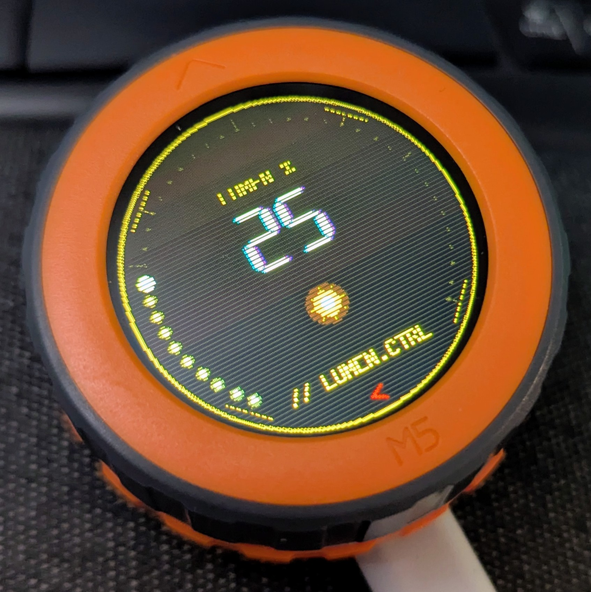
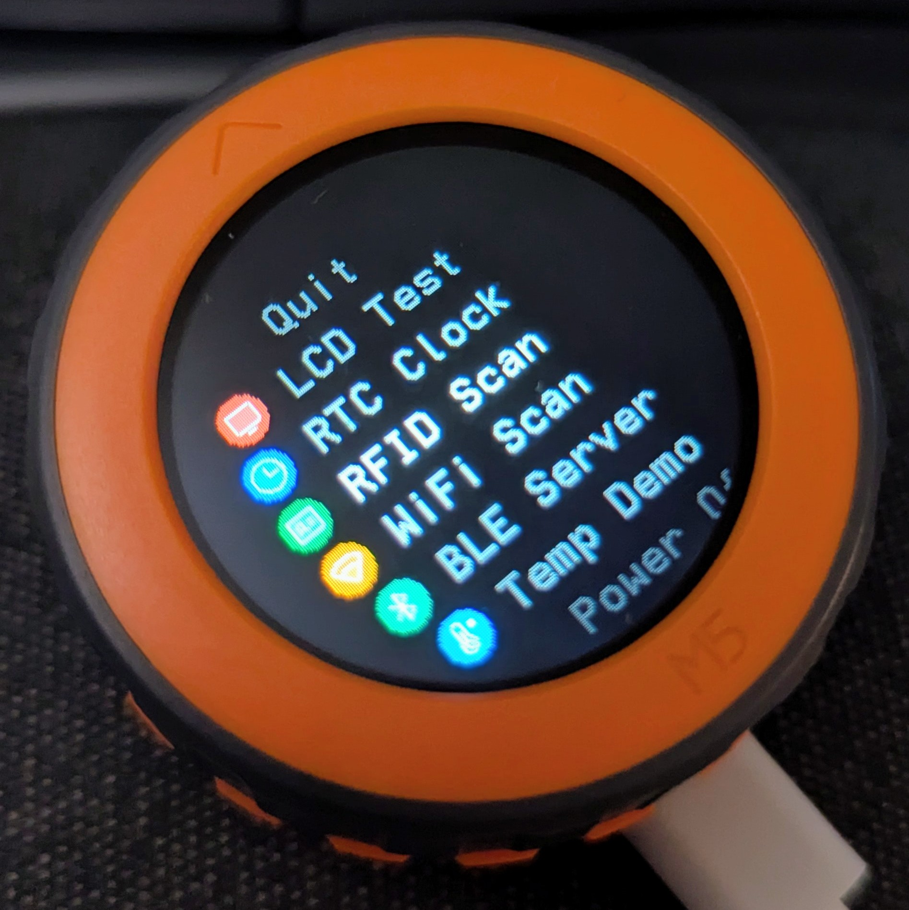

# M5Stack Dial Toolkit

A **PlatformIO + Arduino** firmware for the [M5Stack Dial](https://docs.m5stack.com/en/core/M5Dial) (v1.1) — a port of the official [M5Dial-UserDemo](https://github.com/m5stack/M5Dial-UserDemo) (originally ESP-IDF) rebuilt on the Arduino framework, with a redesigned cyberpunk UI and a BLE volume controller.

The M5Dial is an ESP32-S3 rotary-encoder device with a 240×240 round display, touchscreen, RTC, buzzer, and a built-in RFID reader.

<p align="center">
  
</p>

## Features

- **BLE Volume Controller** — acts as a Bluetooth HID device so the dial controls your computer's master volume. Rotate to adjust, press to mute. Mute-aware: while muted you can keep lowering the level (and drive the host all the way to 0) or rotate up to unmute.
- **Stopwatch / Timer / Pomodoro** — three time apps. The stopwatch times with centisecond precision, the countdown timer ends with a loud resonant alarm, and the pomodoro tracks focus/break cycles with session dots.
- **Brightness Control** — adjust and persist screen brightness (saved to NVS, restored on boot).
- **More menu** — extra apps: LCD test, RTC clock, RFID scanner, WiFi scanner, BLE heart-rate server, temperature demo, and power off.
- **Cyberpunk HUD UI** — neon gauges, CRT scanlines, 7-segment readouts, and a synthwave boot splash.

## Screenshots

| Volume Controller | Brightness | More Menu |
|:---:|:---:|:---:|
|  |  |  |

## Hardware

| Component | Detail |
|---|---|
| MCU | ESP32-S3 (M5StampS3, 8 MB flash) |
| Display | GC9A01 240×240 round SPI LCD |
| Input | Rotary encoder + push button, FT3267 capacitive touch |
| Extras | PCF8563 RTC, buzzer, WS1850S RFID |

## Getting Started

Requires [PlatformIO](https://platformio.org/).

```bash
# Build
pio run

# Build + flash to a connected M5Dial
pio run --target upload

# View serial output
pio device monitor
```

To use the **BLE Volume Controller**, open the app on the dial, then pair with `M5Dial Volume` from your computer's Bluetooth settings.

## Project Structure

```
src/
├── main.cpp            # Arduino setup()/loop() entry point
├── hal/                # Hardware abstraction layer (display, touch, encoder, RTC, buzzer)
└── apps/               # MOONCAKE app framework — launcher + individual apps
```

## Credits

Based on M5Stack's [M5Dial-UserDemo](https://github.com/m5stack/M5Dial-UserDemo) and the [MOONCAKE](https://github.com/Forairaaaaa/mooncake) app framework by Forairaaaaa.
