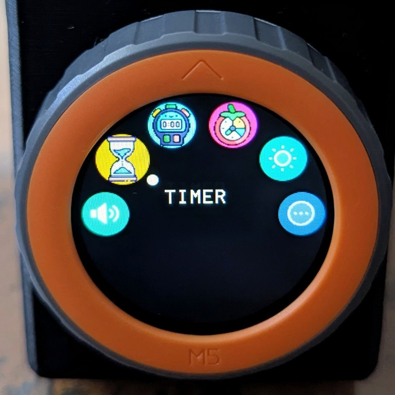
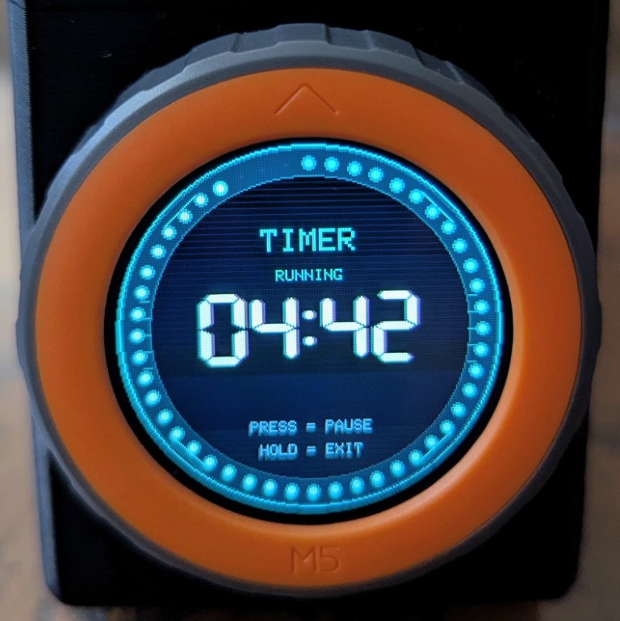
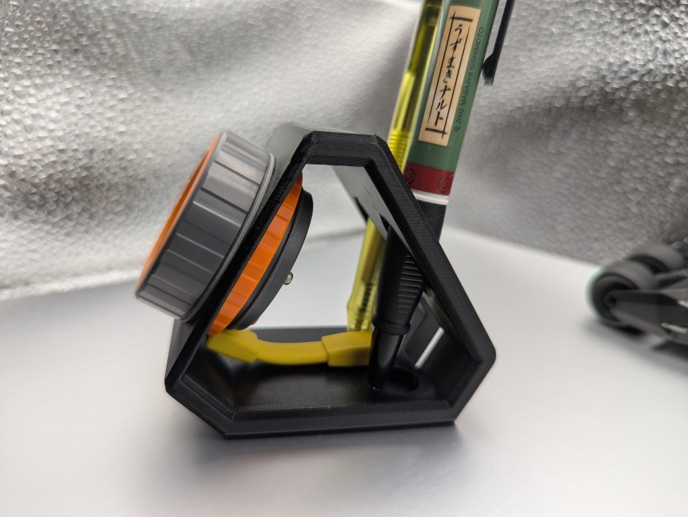

# M5Stack Dial Toolkit

A **PlatformIO + Arduino** firmware for the [M5Stack Dial](https://docs.m5stack.com/en/core/M5Dial) (v1.1) — a port of the official [M5Dial-UserDemo](https://github.com/m5stack/M5Dial-UserDemo) (originally ESP-IDF) rebuilt on the Arduino framework, with a redesigned cyberpunk UI and a BLE volume controller.

The M5Dial is an ESP32-S3 rotary-encoder device with a 240×240 round display, touchscreen, RTC, buzzer, and a built-in RFID reader.

<p align="center">
  
</p>

## Features

- **Watch Face** — the home screen: a cyberpunk "SCOPE" radar clock. A second-sweep hand rotates the rim once a minute with a phosphor trail, `HH:MM` sits in the centre, and turning the dial flips to a date layer (weekday, date, month progress). Press returns to the time, hold exits.
- **BLE Volume Controller** — acts as a Bluetooth HID device so the dial controls your computer's master volume. Rotate to adjust, press to mute. Mute-aware: while muted you can keep lowering the level (and drive the host all the way to 0) or rotate up to unmute.
- **Stopwatch / Timer / Pomodoro** — three time apps. The stopwatch times with centisecond precision, the countdown timer ends with a loud resonant alarm, and the pomodoro tracks focus/break cycles with session dots.
- **Set Time** — set the RTC on-device: turn to adjust the highlighted field, press for the next field, hold to save.
- **Brightness Control** — adjust screen brightness as a clean 0–100 % (persisted to NVS, restored on boot).
- **More menu** — extra apps: LCD test, RTC clock, Set Time, RFID scanner, WiFi scanner, BLE heart-rate server, temperature demo, and power off.
- **Neon-cyberpunk UI** — an electric-yellow / cyan / red palette on near-black, CRT scanlines, an asymmetric HUD frame, 7-segment readouts with a glitchy chromatic-aberration shadow, a "decrypt" boot-in animation on the time apps, and cyberpunk buzzer sound effects (sweeps and arpeggios rather than flat beeps). HTML design prototypes live in [`design/`](design/).

## Screenshots

| Home Menu | Volume Controller | Brightness |
|:---:|:---:|:---:|
|  |  |  |

| More Menu | Timer Screen | |
|:---:|:---:|:---:|
|  |  | |

## 3D Printed Stand

A custom **angled desk stand with a pen holder and USB passthrough** designed for the M5Dial. Download the print files from Printables:

[M5Stack Dial Angled Desk Stand with Pen Holder & USB](https://www.printables.com/model/1758751-m5stack-dial-angled-desk-stand-with-pen-holder-usb)

<p align="center">
  
</p>

## Hardware

| Component | Detail |
|---|---|
| MCU | ESP32-S3 (M5StampS3, 8 MB flash) |
| Display | GC9A01 240×240 round SPI LCD |
| Input | Rotary encoder + push button, FT3267 capacitive touch |
| Extras | PCF8563 RTC, buzzer, WS1850S RFID |

## Getting Started

Requires [PlatformIO](https://platformio.org/).

```bash
# Build
pio run

# Build + flash to a connected M5Dial
pio run --target upload

# View serial output
pio device monitor
```

To use the **BLE Volume Controller**, open the app on the dial, then pair with `M5Dial Volume` from your computer's Bluetooth settings.

### Keeping time

Whenever you flash a genuinely new build, the firmware reseeds the RTC from that build's timestamp (tracked via a marker in NVS, so it can tell "new build" apart from a normal reboot) — it also reseeds if the RTC's current time is implausible, e.g. a brand-new device. A normal reset/power-cycle, or reflashing the exact same build, leaves the clock alone. You can fine-tune it any time in **Set Time**.

The RTC (PCF8563) draws its power straight from the `VBAT_IN` rail — the same rail as the board's LiPo battery input — with **no separate backup cell fitted by default**, so unplugging external power drops that rail to 0V and the clock resets. To retain time while unplugged, plug a small 3.7V single-cell LiPo (JST-1.25 2-pin, matching the socket's polarity marking) into the Dial's onboard battery socket — the onboard charge circuit tops it off whenever USB/DC power is present, and at ~1.9µA sleep draw even a small cell lasts a long time just holding up the RTC.

### Power Off

The More Menu's **Power Off** adapts to however the Dial is powered. On battery, with no USB/DC connected, it genuinely cuts all power — wake it back up with the physical button. Left plugged into USB/DC (where software can't cut power on this board), it instead blanks the screen and drops into a low-power deep sleep; wake it by tapping the touchscreen.

## Project Structure

```
src/
├── main.cpp            # Arduino setup()/loop() entry point
├── hal/                # Hardware abstraction layer (display, touch, encoder, RTC, buzzer)
└── apps/               # MOONCAKE app framework — launcher + individual apps
```

## Credits

Based on M5Stack's [M5Dial-UserDemo](https://github.com/m5stack/M5Dial-UserDemo) and the [MOONCAKE](https://github.com/Forairaaaaa/mooncake) app framework by Forairaaaaa.
